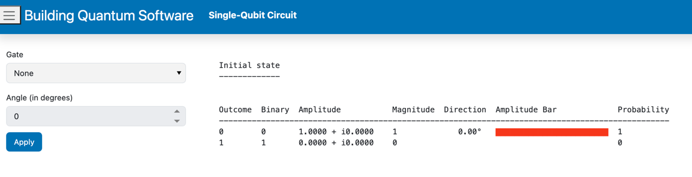
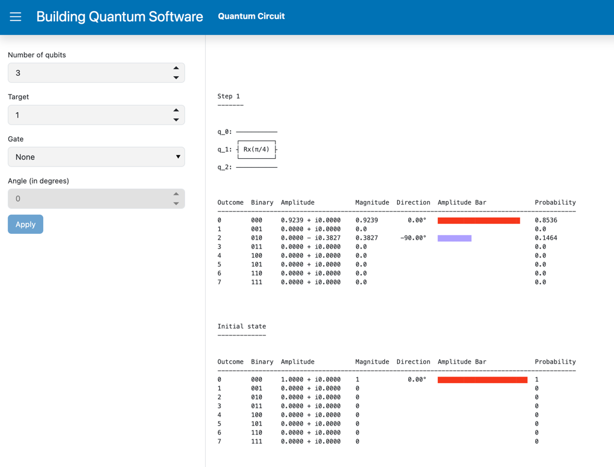

# Building Quantum Software: A Developer's Guide


[](https://mng.bz/Ad87)


[Building Quantum Software: A Developer's Guide](https://mng.bz/Ad87) will teach you the foundations of quantum computing, how to implement quantum computations, and when to take advantage of the benefits of quantum computing.

This repository contains additional resources for the book .

### Setting up the code
#### Clone repository
Start by cloning the repository:
```bash
 git clone https://github.com/learnqc/code_plus
```


#### Code Setup

1. Next, **create a virtual environment** where you can run the code.
```bash
python -m venv bqs-env
```

2. **Activate the new environment.**
```bash
source bqs-env/bin/activate
```

3. **Install the dependencies** for the repository in the virtual environment.
```bash
pip install -r requirements.txt
```

## Run the single-qubit UI application

```bash
cd src 
python -m panel serve experiments/single_qubit.py --show
```



## Run the any-qubit UI application

```bash
cd src 
python -m panel serve experiments/any_qubit.py --show
```



## AI Assistant

### .env file

Create a `.env` file in `src` with `OPENAI_API_KEY` and `SINGLE_QUBIT_ASSISTANT_ID` as variables:

```bash
OPENAI_API_KEY=
SINGLE_QUBIT_ASSISTANT_ID=
```

### Create OpenAI Assistant
Use your OpenAI API Key (see [https://platform.openai.com/api-keys](https://platform.openai.com/api-keys)) to populate the `OPENAI_API_KEY` variable in the `.env` file:

```bash
OPENAI_API_KEY=...
```
Create an OpenAI Assistant equipped with the single qubit circuit tools: in `src`:
```bash
 python ./openai_assistant/single_qubit/assistant_setup.py
 ```
Copy the assistant id from the terminal log:

```bash
Assistant(id='...', created_at
```
(or from your [OpenAI list of assistants](https://platform.openai.com/assistants)) and use it to populate the `SINGLE_QUBIT_ASSISTANT_ID` variable in the `.env` file:

```bash
SINGLE_QUBIT_ASSISTANT_ID=...
```

### Run Browser Assistant

https://github.com/logicalguess/book_assistant/assets/579979/9deafb2b-8e8f-48b8-ab8c-1f7e3996d570

In `src`:
```bash
python -m panel serve ./openai_assistant/single_qubit/single_qubit_panel_assistant.py --show
 ```

### Run Terminal Assistant

In `src`:
```bash
 python ./openai_assistant/single_qubit/single_qubit_terminal_assistant.py
 ```
